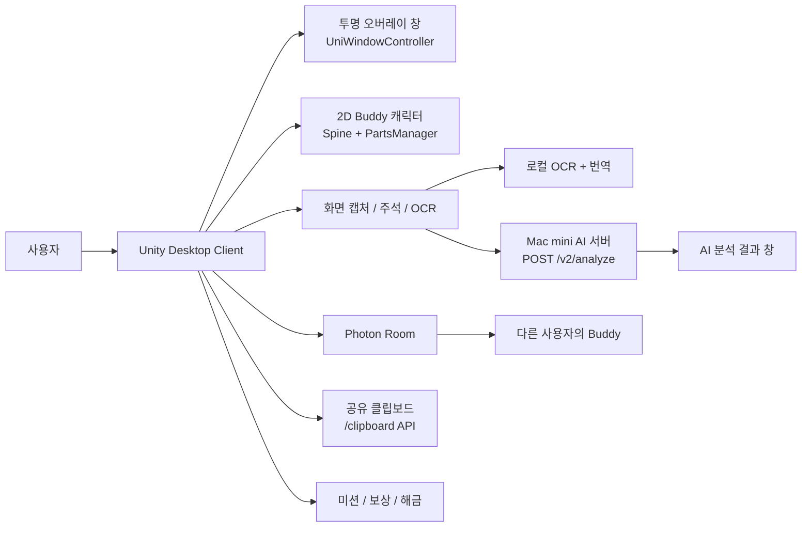
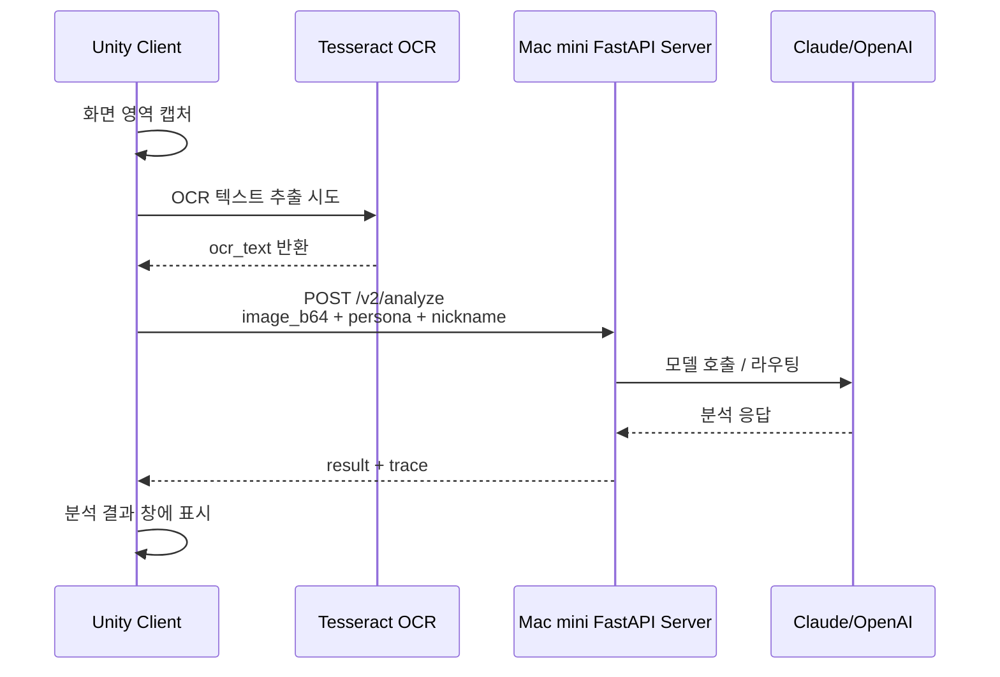
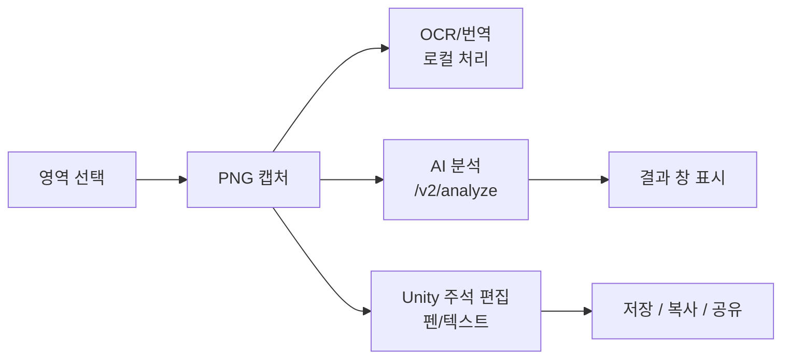
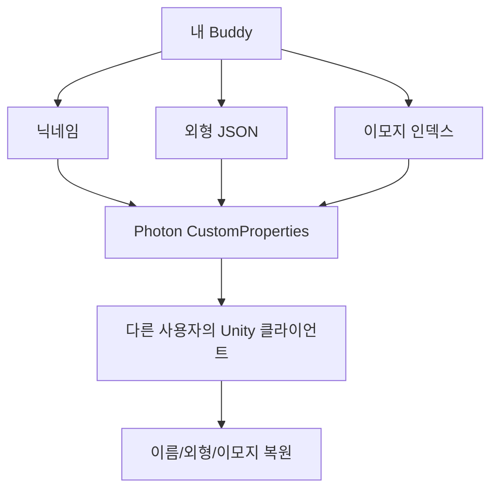

# buddy-unity 리서치 정리

작성일: 2026-06-27  
대상 프로젝트: `buddy-unity/`  
목적: 발표 자료에 넣기 전에, Unity 클라이언트를 처음 보는 사람도 이해할 수 있도록 프로젝트 구성과 구현 내용을 정리한다.

## 1. 한 줄 요약

`buddy-unity`는 사용자의 데스크톱 위에 떠 있는 2D Buddy 캐릭터를 중심으로, 화면 캡처, OCR/번역, AI 서버 분석, 캐릭터 커스터마이징, Photon 기반 멀티 접속, 공유 클립보드, 미션/보상 기능을 묶은 Unity 데스크톱 클라이언트다.

서버가 AI 판단과 데이터 저장을 맡는다면, Unity 클라이언트는 사용자가 실제로 보고 누르는 경험을 담당한다. 즉, 사용자는 Unity 앱에서 캐릭터를 만나고, 캡처 영역을 고르고, 결과를 말풍선/패널로 확인한다.

## 2. 처음 보는 사람을 위한 제품 설명

Buddy는 일반 웹앱이 아니라 데스크톱 위에 떠 있는 컴패니언 앱이다.

사용자가 보는 경험은 다음과 같다.

1. Unity 앱을 실행하면 투명한 창 위에 Buddy 캐릭터가 뜬다.
2. 캐릭터에 마우스를 올리면 메뉴가 나온다.
3. 사용자는 화면 전체 또는 일부 영역을 캡처한다.
4. 캡처한 이미지를 번역하거나, AI 서버에 분석을 요청한다.
5. AI 답변은 Unity 클라이언트 안의 결과 창이나 말풍선 형태로 확인한다.
6. 캐릭터 외형, MBTI 말투, 닉네임, 이모지 등을 설정해 내 Buddy처럼 꾸밀 수 있다.
7. 같은 룸에 접속하면 다른 팀원의 Buddy도 화면에 나타나고, 공유 클립보드로 이미지를 주고받을 수 있다.

핵심은 "AI 서비스로 이동해서 프롬프트를 다시 쓰는 과정"을 줄이고, 현재 화면 위에서 바로 도움을 받게 만드는 것이다.

## 3. 프로젝트 기본 정보

| 항목 | 내용 |
|---|---|
| Unity 버전 | Unity 6000.3.18f1 |
| 주요 플랫폼 | Windows, macOS 대응 코드 존재 |
| 렌더링 | Built-in Render Pipeline 기반 투명 창 |
| 주요 씬 | `Assets/Scenes/Lobby.unity` |
| 주요 빌드 메뉴 | `Tools > Desktop Companion` |
| 캐릭터 에셋 | Layer Lab 2D Art Maker + Spine |
| 투명 창 | UniWindowController |
| 멀티 | Photon PUN 2 |
| UI 보조 | uGUI, TextMesh Pro, Cartoon GUI Pack, DOTween |
| OCR/번역 | Tesseract + keyless Google Translate endpoint |
| AI 분석 서버 | Mac mini FastAPI 서버의 `/v2/analyze` 호출 |

## 4. 큰 구조

## 5. 폴더별 역할

| 경로 | 역할 |
|---|---|
| `Assets/Scripts/Editor/` | Unity 에디터 메뉴와 빌드 자동화. `CompanionSetup.cs`가 씬과 프리팹을 코드로 생성한다. |
| `Assets/Scripts/Companion/` | 사용자가 만지는 핵심 UI. 호버 메뉴, 닉네임, MBTI, 결과 창, 공유 클립보드, 말풍선, 캡처 주석 등이 있다. |
| `Assets/Scripts/Translate/` | 화면 캡처, OCR, 번역, AI 서버 분석 요청 관련 코드. |
| `Assets/Scripts/Character/` | 캐릭터 애니메이션, 외형 저장/복원, 마우스 반응 처리. |
| `Assets/Scripts/Customize/` | 캐릭터 커스터마이징 화면. 파츠 선택, 색상 선택, 해금 상태 표시를 담당한다. |
| `Assets/Scripts/Multiplayer/` | Photon 기반 룸 접속, 아바타 스폰, 이름/외형/이모지 동기화. |
| `Assets/Scripts/Rewards/` | 미션, 경험치, 보상, 아이템 해금 시스템. |
| `Assets/Data/reward.json` | 미션 정의 원본. 에디터에서 사용한다. |
| `Assets/Resources/reward.json` | 빌드 런타임에서 읽는 미션 정의 사본. |
| `Assets/Resources/BuddyAvatar.prefab` | Photon이 런타임에 스폰하는 Buddy 아바타 프리팹. |
| `Packages/com.kirurobo.uniwinc/` | 투명하고 최상단에 뜨는 데스크톱 창을 만들기 위한 UniWindowController 패키지. |

## 6. 실행과 빌드 흐름

이 프로젝트는 씬을 손으로 구성하는 방식보다, 에디터 메뉴에서 코드로 생성하는 방식을 택했다.

주요 메뉴는 `Tools > Desktop Companion` 아래에 있다.

| 메뉴 | 역할 |
|---|---|
| `1. Setup Scene` | `Lobby.unity`를 새로 만들고 카메라, UniWindowController, `BuddyRoomManager`를 배치한다. |
| `2. Build And Run` | Windows용 `Builds/Win64/Buddy.exe`를 빌드하고 실행한다. |
| `2b. Build And Run (macOS)` | macOS용 `Builds/Mac/Buddy.app`을 빌드한다. |
| `Build Buddy Avatar Prefab` | `Resources/BuddyAvatar.prefab`을 생성한다. Photon 스폰에 필요한 프리팹이다. |
| `Fix Player Settings Only` | 투명 창, HTTP 허용, 그래픽 API 등 Player Settings를 맞춘다. |

설계상 `Lobby.unity`에는 캐릭터가 직접 놓이지 않는다. 실행 시 `BuddyRoomManager`가 Photon OfflineMode 또는 온라인 룸을 열고 `Resources/BuddyAvatar.prefab`을 스폰한다.

이렇게 한 이유는 혼자 쓰는 모드와 멀티 모드를 같은 코드 경로로 처리하기 위해서다. 솔로 모드도 Photon OfflineMode를 사용하므로, 나중에 온라인 룸에 들어갈 때 구조가 크게 바뀌지 않는다.

## 7. 사용자 흐름 기준 기능 정리

### 7.1 Buddy 캐릭터와 호버 메뉴

관련 코드:

- `Assets/Scripts/Companion/CompanionMenu.cs`
- `Assets/Scripts/Companion/CompanionUiSkin.cs`
- `Assets/Scripts/Character/CharacterAnimator.cs`
- `Assets/Scripts/Companion/FullscreenWindow.cs`
- `Packages/com.kirurobo.uniwinc/`

Buddy 캐릭터는 투명 창 위에 떠 있고, 사용자가 캐릭터 위에 마우스를 올리면 메뉴가 나타난다.

메뉴에서 할 수 있는 일은 다음과 같다.

- 화면 캡처
- 번역 캡처
- 이미지 분석
- 공유 클립보드 열기
- MBTI 페르소나 설정
- 닉네임 설정
- 캐릭터 커스터마이징
- Photon 룸 접속
- 이모지 표현
- 모니터 이동
- 앱 종료

투명 창은 `UniWindowController`가 담당한다. 창은 데스크톱 위에 최상단으로 떠 있지만, 투명한 영역은 클릭이 통과하도록 처리한다. 그래서 사용자는 Buddy가 없는 화면 영역에서는 평소처럼 다른 앱을 클릭할 수 있다.

### 7.2 화면 캡처, OCR, 번역

관련 코드:

- `Assets/Scripts/Translate/DesktopScreenCapture.cs`
- `Assets/Scripts/Translate/TranslateCapture.cs`
- `Assets/Scripts/Translate/OcrService.cs`
- `Assets/Scripts/Translate/GoogleTranslateFree.cs`
- `Assets/Scripts/Translate/OcrImagePrep.cs`

화면 캡처 기능은 전체 화면 또는 사용자가 드래그한 영역을 PNG로 만든다.

번역 기능은 다음 순서로 동작한다.

1. 사용자가 영역을 선택한다.
2. Unity가 해당 영역을 이미지로 캡처한다.
3. Tesseract가 이미지 안의 글자를 OCR로 추출한다.
4. keyless Google Translate endpoint로 번역한다.
5. 원문과 번역 결과를 Unity 패널에 표시한다.
6. 사용자는 결과를 복사하거나 파일로 저장할 수 있다.

이 번역 흐름은 서버 AI 비용 없이 로컬/무료 경로로 처리한다. AI 서버 분석과 번역 기능을 분리한 것이 특징이다.

### 7.3 AI 서버 이미지 분석

관련 코드:

- `Assets/Scripts/Translate/ImageAnalyzeApi.cs`
- `Assets/Scripts/Companion/AnalyzeResultWindow.cs`
- `Assets/Scripts/Companion/PersonaPanel.cs`
- `Assets/Scripts/Companion/NicknameStore.cs`
- `Assets/Scripts/Companion/PersonaStore.cs`

Unity 클라이언트는 캡처 이미지를 Mac mini 서버로 보낸다.

현재 코드 기준 요청 대상은 다음과 같다.

- Base URL: `http://10.99.24.103:8000`
- Endpoint: `POST /v2/analyze`
- 방식: 일반 JSON POST, 스트리밍 아님
- 주요 필드: `nickname`, `persona`, `mode`, `detail`, `image_b64`, `ocr_text`, `user_text`, `server_ocr`

요청 흐름은 다음과 같다.

`AnalyzeResultWindow`는 서버 응답의 결과와 trace 정보를 보여준다. 기본은 짧은 답변이고, 사용자가 `자세히 보기`를 누르면 같은 이미지로 `detail=full` 요청을 다시 보낸다.

MBTI 페르소나는 `PersonaPanel`에서 16개 유형 중 하나를 고르고, 선택값은 `PlayerPrefs`에 저장된다. 이 값이 AI 분석 요청의 `persona` 필드로 들어가 서버가 응답 말투를 조정한다.

### 7.4 캡처 이미지 주석과 편집

관련 코드:

- `Assets/Scripts/Companion/CaptureAnnotator.cs`
- `Assets/Scripts/Companion/ImageClipboard.cs`

이미지 편집은 서버가 아니라 Unity 클라이언트가 담당한다.

`CaptureAnnotator`는 캡처한 이미지를 보여주고, 사용자가 그 위에 펜으로 표시하거나 텍스트 박스를 추가할 수 있게 한다. 수정된 이미지는 저장하거나 OS 클립보드에 복사할 수 있다.

발표에서 중요한 점은 다음과 같다.

- AI 서버는 이미지 이해와 응답 생성에 집중한다.
- 실제 이미지 위에 펜/텍스트를 얹고 저장하는 UI는 Unity가 처리한다.
- 따라서 긴 스크린샷을 AI 이미지 편집 모델에 맡길 때 생기는 텍스트 깨짐 리스크를 피할 수 있다.

### 7.5 캐릭터 커스터마이징

관련 코드:

- `Assets/Scripts/Customize/CustomizeCodex.cs`
- `Assets/Scripts/Customize/CustomizeReturn.cs`
- `Assets/Scripts/Customize/CustomizeSceneBootstrap.cs`
- `Assets/Scripts/Character/CharacterStore.cs`
- `Assets/Layer Lab/2D Art Maker/`
- `Assets/Spine/`

캐릭터는 Layer Lab 2D Art Maker와 Spine 기반으로 구성되어 있다. 사용자는 헤어, 눈, 입, 상의, 하의, 장비, 색상 등을 고를 수 있다.

커스터마이징 저장 흐름은 다음과 같다.

1. 사용자가 커스터마이즈 화면에서 파츠와 색상을 고른다.
2. `CharacterStore.Save`가 파츠 index와 색상을 JSON으로 저장한다.
3. 저장 위치는 `Application.persistentDataPath/companion_character.json`이다.
4. Buddy가 다시 나타날 때 `CharacterStore.Apply`가 저장된 JSON을 읽어 외형을 복원한다.
5. 멀티 룸에서는 같은 JSON 문자열이 Photon CustomProperties로 공유되어 다른 사람 화면에도 내 외형이 보인다.

이 구조의 장점은 "내 캐릭터"라는 개인화 경험이 단순 로컬 저장에서 끝나지 않고 멀티 아바타 표현까지 이어진다는 점이다.

### 7.6 Photon 멀티

관련 코드:

- `Assets/Scripts/Multiplayer/BuddyRoomManager.cs`
- `Assets/Scripts/Multiplayer/BuddyAvatar.cs`
- `Assets/Scripts/Multiplayer/BuddyNetwork.cs`
- `Assets/Scripts/Multiplayer/EmojiBubble.cs`
- `Assets/Scripts/Multiplayer/EmojiHistory.cs`

멀티 기능은 Photon PUN 2를 기반으로 한다.

구조는 다음과 같다.

- `BuddyRoomManager`: Photon 연결, 룸 입장/퇴장, 로컬 아바타 스폰을 담당한다.
- `BuddyAvatar`: Photon으로 스폰되는 각 Buddy 캐릭터의 동작을 담당한다.
- `BuddyNetwork`: 이름, 외형, 이모지 같은 프로필 데이터를 Photon CustomProperties로 공유한다.
- `EmojiBubble`: 캐릭터 머리 위 이모지를 표시한다.

특이한 점은 솔로 모드도 Photon OfflineMode로 처리한다는 점이다. 즉, 혼자 쓸 때도 "내 아바타를 Photon 방식으로 스폰"하고, 온라인 룸에 들어가도 같은 `BuddyAvatar` 구조를 쓴다.

동기화되는 데이터는 다음과 같다.

| 데이터 | 저장/전달 방식 | 설명 |
|---|---|---|
| 닉네임 | PlayerPrefs + Photon NickName + CustomProperties | 캐릭터 이름 라벨과 AI 요청 nickname에 사용 |
| 외형 | `companion_character.json` + CustomProperties `appearance` | 다른 사용자의 화면에서 내 캐릭터 외형 복원 |
| 이모지 | CustomProperties `emoji` | 현재 선택한 이모지를 늦게 들어온 사용자도 볼 수 있음 |
| 위치 | Photon 아바타 스폰 위치 | ActorNumber 기반으로 겹치지 않게 배치 |

현재 `PhotonAppSettings.asset`의 AppId 값은 비어 있는 상태로 보인다. 실제 온라인 멀티 시연을 하려면 Photon Realtime AppId 설정이 필요하다.

### 7.7 공유 클립보드

관련 코드:

- `Assets/Scripts/Companion/SharedClipboardPanel.cs`
- `Assets/Scripts/Companion/SharedClipboardApi.cs`
- `Assets/Scripts/Companion/ImageClipboard.cs`

공유 클립보드는 이미지를 팀원과 함께 쓰기 위한 기능이다.

Unity 클라이언트는 같은 Mac mini 서버의 `/clipboard` API를 호출한다.

| API | 역할 |
|---|---|
| `GET /clipboard` | 공유된 이미지 목록 조회 |
| `POST /clipboard` | 캡처 이미지 업로드 |
| `GET /clipboard/{id}/raw` | 이미지 원본 다운로드 |
| `DELETE /clipboard/{id}` | 이미지 삭제 |

사용자는 캡처한 이미지를 공유 클립보드에 올릴 수 있고, 다른 사용자는 그 이미지를 받아 OS 클립보드로 복사해 다른 앱에 붙여넣을 수 있다.

이 기능은 "같은 와이파이 안의 Mac mini 서버"라는 시연 환경과 잘 맞는다. 서버가 이미지 저장소 역할을 하고, Unity 클라이언트들이 그 서버를 통해 이미지를 주고받는다.

### 7.8 미션과 보상

관련 코드:

- `Assets/Scripts/Rewards/MissionTracker.cs`
- `Assets/Scripts/Rewards/MissionDatabase.cs`
- `Assets/Scripts/Rewards/MissionEvents.cs`
- `Assets/Scripts/Rewards/PlayerProgress.cs`
- `Assets/Scripts/Rewards/UnlockState.cs`
- `Assets/Data/reward.json`

보상 시스템은 데이터 기반으로 구성되어 있다.

`reward.json`에는 다음과 같은 미션이 정의되어 있다.

- 첫 로그인
- MBTI 설정
- 3일/7일 연속 출석
- 첫 번역
- 오늘의 번역 3회
- 첫 커스터마이즈
- 오늘의 첫 스크린샷
- 오늘의 첫 클립보드
- 누적 3일 출석

`MissionTracker`는 사용자의 진행 상황을 `mission_progress.json`으로 저장한다. 번역 성공, 커스터마이즈 저장, 캡처, 클립보드 사용 같은 이벤트가 발생하면 미션 카운트가 올라가고, 보상을 받을 수 있다.

이 기능은 발표에서 "Buddy를 계속 쓰고 싶게 만드는 성장/해금 구조"로 설명하면 좋다.

## 8. 서버와 Unity 클라이언트의 역할 분리

| 영역 | Unity 클라이언트 | Mac mini 서버 |
|---|---|---|
| 화면 캡처 | 사용자가 영역 선택, 이미지 생성 | 관여하지 않음 |
| OCR/번역 | 로컬 Tesseract + 무료 번역 처리 | 관여하지 않음 |
| AI 분석 | 이미지와 persona를 서버로 전송, 결과 표시 | `/v2/analyze`에서 모델 호출 |
| 이미지 편집 | 펜/텍스트 주석, 저장, 복사 | 관여하지 않음 |
| 공유 클립보드 | 업로드/조회/다운로드 UI 제공 | `/clipboard`로 이미지 저장/제공 |
| MBTI 말투 | persona 선택 UI 제공 | persona 기반 응답 생성 |
| API Key 보호 | 키를 직접 보유하지 않음 | Claude/OpenAI 키를 서버에서 관리 |
| 멀티 | Photon으로 캐릭터 표시/이모지 공유 | 직접 관여하지 않음 |

발표에서는 이 분리가 중요하다. Unity는 사용자 경험을 담당하고, 서버는 AI 호출과 데이터 저장을 담당한다. 덕분에 Unity 클라이언트에 Claude/OpenAI 키를 넣지 않아도 되고, 같은 Wi-Fi의 Mac mini 서버를 통해 여러 클라이언트가 동일한 API를 호출할 수 있다.

## 9. 발표 자료에 넣기 좋은 핵심 메시지

### 메시지 1. Unity 클라이언트는 실제 사용 경험의 중심이다

서버와 AI 모델이 아무리 좋아도 사용자가 만지는 것은 Unity 클라이언트다. Buddy 캐릭터, 호버 메뉴, 캡처 영역 선택, 결과 창, 말풍선, 커스터마이징은 모두 Unity에서 구현된다.

### 메시지 2. 캡처부터 응답까지 한 화면에서 끝난다

사용자는 스크린샷을 찍고 다른 AI 서비스로 이동할 필요가 없다. Unity 앱 안에서 캡처하고, 서버 분석을 요청하고, 결과를 바로 확인한다.

### 메시지 3. 이미지 편집은 AI 모델이 아니라 Unity UI가 맡는다

긴 스크린샷을 이미지 편집 모델로 수정하면 텍스트가 깨질 수 있다. Buddy는 서버가 이미지를 이해하고 답변하게 하고, 실제 펜/텍스트 편집은 Unity 클라이언트에서 처리한다.

### 메시지 4. 개인화가 멀티 표현까지 이어진다

사용자가 고른 외형은 로컬 JSON으로 저장되고, 멀티 룸에서는 Photon CustomProperties로 공유된다. 그래서 내 화면뿐 아니라 다른 사람 화면에서도 내 Buddy가 같은 모습으로 보인다.

### 메시지 5. Mac mini 서버와 같은 Wi-Fi 시연 환경에 맞춰 설계됐다

Unity 클라이언트는 같은 Wi-Fi에 있는 Mac mini 서버로 HTTP 요청을 보낸다. 서버는 AI API Key와 로그를 중앙에서 관리하고, Unity 클라이언트는 필요한 데이터만 주고받는다.

## 10. 발표용 슬라이드 후보 구조

### 슬라이드 A. Unity 클라이언트가 담당한 사용자 경험

- 데스크톱 위에 뜨는 Buddy 캐릭터
- 호버 메뉴 기반 조작
- 화면 캡처/영역 선택
- AI 결과 창과 말풍선
- 커스터마이징과 이모지

### 슬라이드 B. 캡처 후 처리 흐름

### 슬라이드 C. 멀티와 개인화

### 슬라이드 D. Unity와 서버의 책임 분리

- Unity: 캡처, 편집, UI, 캐릭터, 멀티 표현
- Server: AI 분석, 모델 라우팅, 공유 클립보드 저장
- Photon: 룸 접속, 아바타 상태 공유

## 11. 현재 확인된 리스크와 후속 작업

| 항목 | 현재 상태 | 발표/시연 전 확인 |
|---|---|---|
| Photon AppId | `PhotonAppSettings.asset`의 AppId가 비어 있는 상태로 보임 | 실제 온라인 멀티 시연 시 AppId 설정 필요 |
| AI 서버 주소 | `ImageAnalyzeApi.BaseUrl = http://10.99.24.103:8000` 하드코딩 | Mac mini IP가 바뀌면 수정 필요 |
| HTTP 허용 | `PlayerSettings.insecureHttpOption = AlwaysAllowed` 설정 | Setup Scene/Fix Settings 실행 필요 |
| macOS 캡처/OCR | macOS 대응 코드와 빌드 메뉴 존재 | 화면 기록 권한, tesseract 실행 비트, 좌표계 실기 검증 필요 |
| Tesseract | StreamingAssets 경로를 사용 | 빌드 산출물에 바이너리와 tessdata 포함 확인 |
| 미션 보상 아이템 | `reward.json`과 `ItemCatalog` 기반 | 실제 파츠 index가 의도한 아이템인지 확인 필요 |
| Resources 프리팹 | Photon 스폰은 `Resources/BuddyAvatar.prefab`에 의존 | 프리팹 재생성 후 컴포넌트 누락 없는지 확인 필요 |

## 12. 발표에 바로 쓸 수 있는 설명문

`buddy-unity`는 Buddy의 실제 사용자 경험을 담당하는 Unity 데스크톱 클라이언트입니다. 사용자는 데스크톱 위에 떠 있는 Buddy 캐릭터를 통해 화면을 캡처하고, 번역하거나 AI 서버에 분석을 요청할 수 있습니다. AI 답변은 별도 웹 페이지가 아니라 Unity 안의 결과 창과 말풍선으로 돌아옵니다.

클라이언트는 단순히 서버 API를 호출하는 껍데기가 아니라, 캡처 영역 선택, 이미지 주석 편집, 캐릭터 커스터마이징, MBTI 선택, 공유 클립보드, Photon 기반 멀티 표현까지 담당합니다. 특히 이미지 편집은 서버의 AI 이미지 편집 모델에 맡기지 않고 Unity UI에서 펜과 텍스트로 처리해, 긴 스크린샷의 텍스트가 깨지는 리스크를 줄였습니다.

서버와의 연결은 같은 Wi-Fi 안의 Mac mini FastAPI 서버를 기준으로 설계되어 있습니다. Unity는 캡처 이미지와 OCR 텍스트, 닉네임, MBTI persona를 `/v2/analyze`로 보내고, 서버는 Claude/OpenAI 키와 모델 호출을 중앙에서 관리합니다. 덕분에 클라이언트에는 API Key를 노출하지 않고, 여러 Unity 클라이언트가 같은 서버를 안정적으로 호출할 수 있습니다.

멀티 기능은 Photon을 사용합니다. 사용자의 닉네임, 캐릭터 외형 JSON, 이모지 상태를 Photon CustomProperties로 공유해, 다른 사람 화면에서도 내 Buddy가 같은 모습으로 보입니다. 공유 클립보드는 서버의 `/clipboard` API를 통해 이미지를 업로드하고 내려받는 방식으로 구현되어, 팀원 간 화면 자료 공유까지 하나의 경험 안에 넣었습니다.

## 13. 참고한 주요 파일

- `buddy-unity/AGENTS.md`
- `buddy-unity/CLAUDE.md`
- `buddy-unity/desktop_companion_handoff.md`
- `buddy-unity/Assets/Scripts/Editor/CompanionSetup.cs`
- `buddy-unity/Assets/Scripts/Companion/CompanionMenu.cs`
- `buddy-unity/Assets/Scripts/Translate/TranslateCapture.cs`
- `buddy-unity/Assets/Scripts/Translate/ImageAnalyzeApi.cs`
- `buddy-unity/Assets/Scripts/Companion/AnalyzeResultWindow.cs`
- `buddy-unity/Assets/Scripts/Companion/CaptureAnnotator.cs`
- `buddy-unity/Assets/Scripts/Companion/SharedClipboardPanel.cs`
- `buddy-unity/Assets/Scripts/Companion/SharedClipboardApi.cs`
- `buddy-unity/Assets/Scripts/Multiplayer/BuddyRoomManager.cs`
- `buddy-unity/Assets/Scripts/Multiplayer/BuddyAvatar.cs`
- `buddy-unity/Assets/Scripts/Multiplayer/BuddyNetwork.cs`
- `buddy-unity/Assets/Scripts/Character/CharacterStore.cs`
- `buddy-unity/Assets/Scripts/Customize/CustomizeCodex.cs`
- `buddy-unity/Assets/Scripts/Rewards/MissionTracker.cs`
- `buddy-unity/Assets/Data/reward.json`
